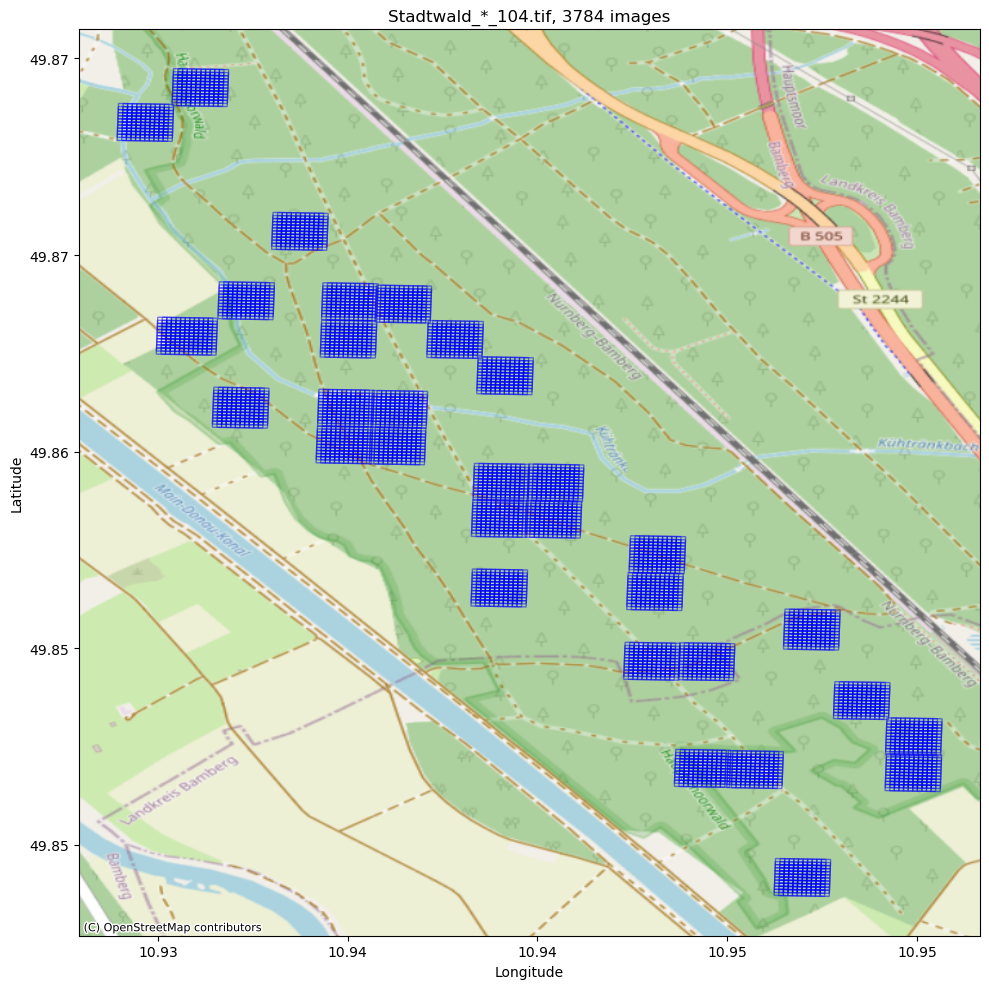
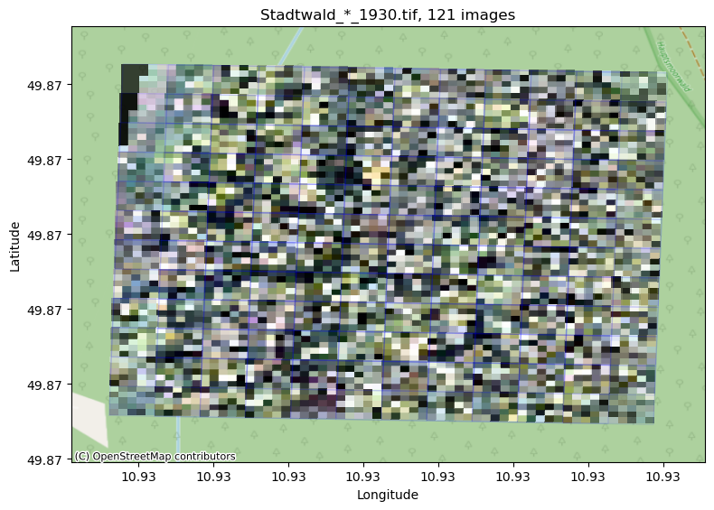
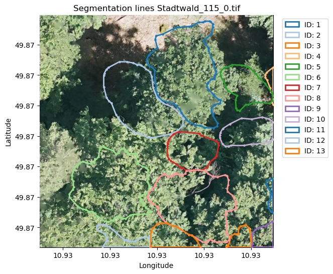

# BAMFORESTS: Bamberg Benchmark Forest Dataset of Individual Tree Crowns in Very-High-Resolution UAV Images

Exists only the UAV images with specie-annotations and segmentations. The band for 'canopy height' is empty.


<div style="display: flex; justify-content: space-around;">
    
    
    
</div>

<br>

```
data/bamforests/
├── README.md
├── src/
│   ├── output.png
│   ├── output1.png
│   └── output2.png
├── coco1024/
│   ├── annotations/
│   │   ├── instances_tree_TestSet12023.json
│   │   ├── instances_tree_TestSet22023.json
│   │   ├── instances_tree_eval2023.json
│   │   └── instances_tree_train2023.json
│   ├── test2023/
│   │   ├── Test-Set-1/
│   │   │   └── ( .tif )
│   │   ├── Test-Set-2/
│   │   │   └── ( .tif )
│   ├── train2023/
│   │   └── ( .tif.aux.xml )
└── ── val2023/
        └── ( .tif )
 
```

<br>

> [!ref] Troles, J., Schmid, U., Fan, W., & Tian, J. (2024). BAMFORESTS: Bamberg Benchmark Forest Dataset of Individual Tree Crowns in Very-High-Resolution UAV Images. Remote Sensing, 16(11), 1935.
>
> If you use this data for research, please cite our MDPI Journal paper.
> If you would like to use this data for commercial purposes, please contact us (jonas.troles@uni-bamberg.de; jiaojiao.tian@dlr.de)
>
> This work is licensed under a CC BY-NC-SA 4.0 Deed license.

### Usage

This dataset is provided for the exclusive use of my thesis research. 