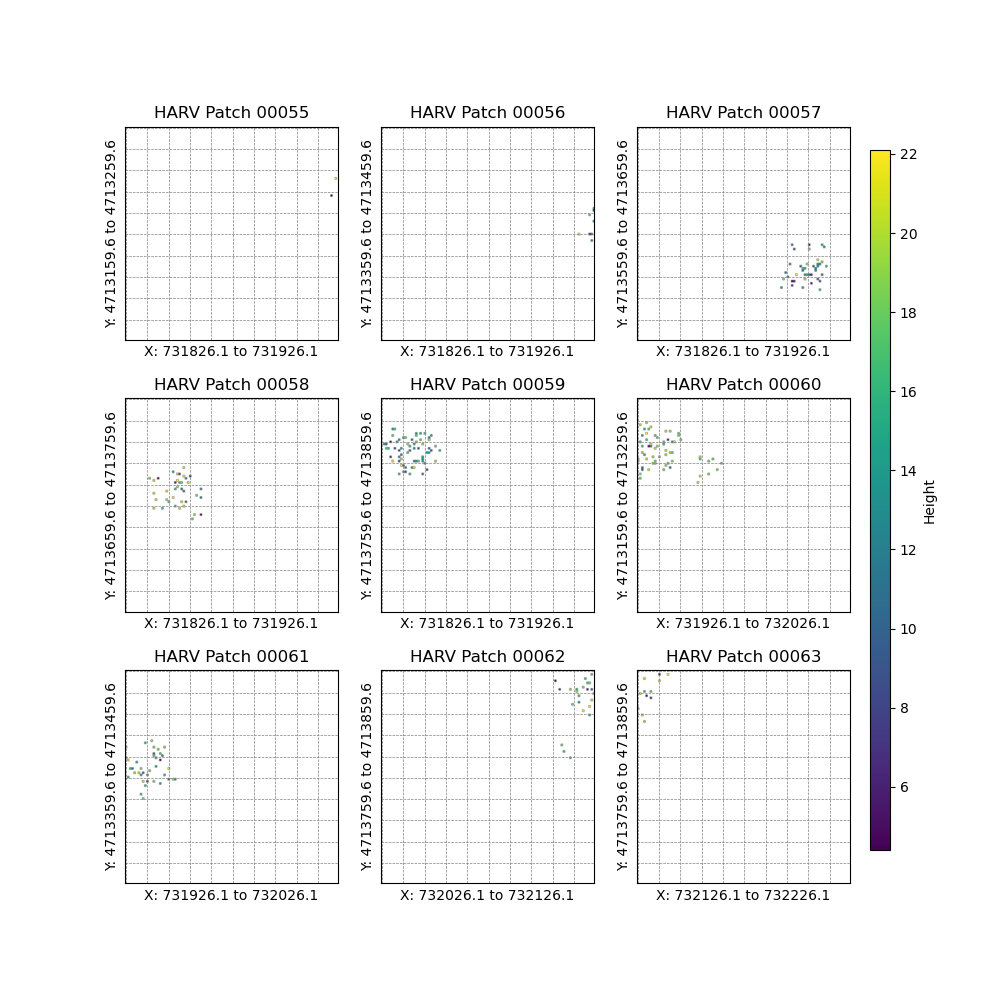

# 🌲 NEON Data Processing & Analysis

---

## 1️⃣ Dataset Content & Data Sources

> The work focuses on **NEON (National Ecological Observatory Network)** multi-site (e.g., HARV, UNDE, YELL, GUAN, BART) forest plot vegetation structure data processing, spatialization, visualization, and aboveground biomass estimation.
> 
> **Main data sources:**
> - Official NEON data products (e.g., DP1.10098.001)
> - Global wood density databases (Zanne2009, Chave2014, USDA, etc.)

### 📁 Data Folder Structure
| Folder/File           | Description                                                                 |
|----------------------|-----------------------------------------------------------------------------|
| `NEON_struct-plant/` | **Raw vegetation structure data** for each site, downloaded from NEON, in CSV |
| `*_patch/`           | **Generated by processing**, contains patch tiles (GeoTIFF), 100m×100m window |
| `*_plots/`           | Visualization outputs (e.g., PNG, HTML)                                      |
| `*_out.txt`          | Log outputs                                                                  |

> The current example uses HARV, UNDE, YELL, GUAN, BART, but **the structure is scalable to all NEON forest sites for batch analysis**.

---

### 📦 Data Storage Example & File Descriptions

> **Example:**
> - For the BART site, after download, data is stored in `data/NEON/BART/NEON_struct-plant/`.
> - This folder contains subfolders for each year/batch, e.g.:
>   - `data/NEON/BART/NEON_struct-plant/NEON.D01.BART.DP1.10098.001.2014-08.basic.20250129T000730Z.RELEASE-2025/`
> - Each subfolder corresponds to a sampling year (e.g., August 2014), containing all raw and metadata files for that batch.

#### Example: Contents of `data/NEON/BART/NEON_struct-plant/NEON.D01.BART.DP1.10098.001.2014-08.basic.20250129T000730Z.RELEASE-2025/`

| File Name | Description |
|-----------|-------------|
| **NEON.D01.BART.DP1.10098.001.readme.20250129T000730Z.txt** | Official readme, detailed introduction to the data product, sampling design, file contents, naming conventions, known issues, etc. Highly recommended as the first file to read. |
| **NEON.D01.BART.DP1.10098.001.variables.20241118T083818Z.csv** | Variable description table, listing all fields in all data tables, their meaning, data type, units, etc. Essential for understanding the data structure. |
| **NEON.D01.BART.DP1.10098.001.EML.20140805-20140827.20250129T000730Z.xml** | Machine-readable metadata (Ecological Metadata Language), describing the package structure, collection methods, contact info, etc. |
| **NEON.D01.BART.DP0.10098.001.categoricalCodes.20241118T083818Z.csv** | Categorical code table, defines all categorical variables (e.g., growth form, status) and their meanings. |
| **NEON.D01.BART.DP0.10098.001.validation.20241118T083818Z.csv** | Data validation and parsing rules, describing valid value ranges, formats, etc. for each field. |
| **NEON.D01.BART.DP1.10098.001.vst_mappingandtagging.basic.20241118T083818Z.csv** | Main data table, records each tree/shrub's spatial location, ID, species, genus, measurement time, etc. Foundation for spatial analysis. |
| **NEON.D01.BART.DP1.10098.001.vst_perplotperyear.2014-08.basic.20241118T083818Z.csv** | Per-plot, per-year sampling metadata, including plot location, sampled area, sampling type, presence/absence of target vegetation, etc. |

> Other years/batches have the same structure, making batch processing and automation straightforward.

---

## 2️⃣ Main Data Processing Workflow

### 2.1 🧹 Data Preprocessing & Merging
- **Read vst_perplotperyear:** Extract geographic info (lat/lon, projected coordinates) for each plot
- **Merge mappingandtagging & apparentindividual:** Join by `individualID` to get each tree's spatial position, species, genus, height, DBH, etc.
- **Spatial positioning:** Calculate each tree's lat/lon and projected coordinates (easting, northing) using plot center and polar coordinates (distance, azimuth)
- **Deduplication & missing value handling:** Remove duplicates by spatial coordinates, keep latest records, handle missing values

### 2.2 🌳 Biomass Estimation
- **Wood density matching:** Lookup `scientificName` in `wood_density.json`, use default (0.55) if not found
- **Biomass formula:** Use Chave et al.'s allometric equations, combining height, DBH, and density to estimate aboveground biomass (AGB)

### 2.3 🟩 Patch Tile Generation & Rasterization
- **Patch tile generation:** Use 100m×100m windows, stride 100m, rasterize tree height, genus code, biomass into GeoTIFF (multi-band) for each patch
- **Band description:**
    1. Band 1: Tree height
    2. Band 2: Genus code
    3. Band 3 (bio version): Biomass

### 2.4 📊 Visualization & Output
- **Spatial distribution maps:** For each site, generate tree point distribution maps (e.g., `HARV_processed_tree_distribution.png`)
- **Patch tile visualization:** e.g., `HARV_patch_tiles.png`, shows spatial distribution of patch rasters
- **Multi-band patch visualization:** e.g., `HARV_patch55_height_genus_biomass.png`, shows height, genus, and biomass in a patch
- **Interactive maps:** e.g., `HARV_tree_distribution.html`, for interactive exploration in browser
- **Log outputs:** e.g., `HARV_out.txt`, records details of each processing step, data volume, missing value stats, etc.

---

## 3️⃣ Typical Results

### 3.1 🗺️ Spatial Distribution & Patch Examples

> **HARV site spatial distribution and patch visualization**

- 
  - Shows all tree locations at HARV, with dense areas indicating core plots.

- 
  - 9 patch tiles, showing tree height distribution, clear patch boundaries.

- 
  - Multi-band visualization for a single patch: left = height, middle = genus, right = biomass.

- 
  - Plot locations overlaid on OSM basemap for spatial reference.

### 3.2 🏞️ Other Sites

> All sites (UNDE, YELL, GUAN, BART) have corresponding patch tiles, spatial maps, and multi-band patch visualizations, with consistent file naming for easy batch analysis and comparison.

---

## 4️⃣ Notice!

> ⚠️ **Wood density matching:** Some species lack density info in the database; supplement manually or use default. Consider improving the database.
> 
> ⚙️ **Patch rasterization:** Patch window, stride, and resolution are adjustable; tune based on plot density and analysis needs.
> 
> 💾 **Large data volume:** Test on small areas first; batch processing may require significant memory and storage.
> 
> 👀 **Visualization:** Use both interactive (folium) and static maps for quality control and spatial checks.
> 
> 🔁 **Script reusability:** `process_NEON.py` and `process_NEON_bio.py` have similar structure, enabling batch processing for multiple sites.
> 
> 🌍 **Site scalability:** Just download new site's `NEON_struct-plant` data and process with the same workflow; suitable for national/global scale batch analysis.

---

## 5️⃣ Future Work

- 🛰️ **InSAR data alignment:** See README for Sentinel-1 data acquisition and processing; align radar DEM/deformation with patch data for multi-source analysis.
- 🌱 **Attribute expansion:** Add diversity, canopy structure, and other ecological indicators.
- 🤖 **Automation & batch processing:** Parameterize scripts for command-line batch processing of multiple sites.

---

> 💡 For detailed code explanations, parameter descriptions, or patch-InSAR alignment scripts, feel free to ask! 