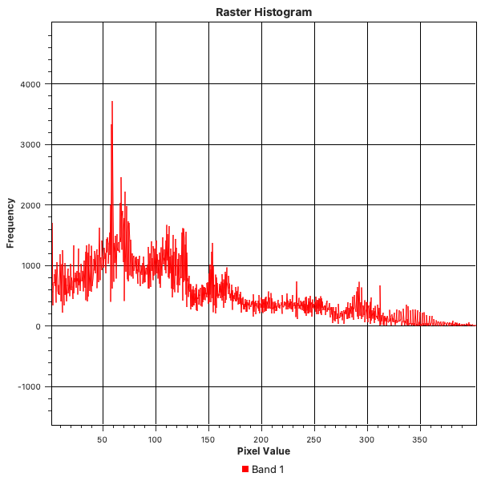

# EU27 Aboveground Biomass Dataset

## Overview

This dataset provides a map of the forest aboveground woody biomass stock (tons/ha) of the EU27 at 100 m resolution. It is based on the ESA CCI biomass map for 2018 (v3) and has been modified to match the harmonized NFI statistics at the sub-national level for the year 2020.

## Folder Structure

```
data/eu27_biomass/
├── AGB_2020_EU27/
│   └── AGB_2020_EU27.tif
├── src/
│   ├── histogram_qgis.png
│   ├── spatial_overview_1.pgw
│   ├── spatial_overview_1.png
│   ├── spatial_overview.png
│   └── spatial_overview.pgw
├── preview.ipynb
└── .ipynb_checkpoints/
```

## Biomass Raster Metadata

| Attribute      | Value |
|---------------|-------|
| **File**      | `AGB_2020_EU27/AGB_2020_EU27.tif` |
| **Driver**    | GTiff |
| **Data type** | float32 |
| **NoData**    | -3.4028234663852886e+38 |
| **Width**     | 46,803 |
| **Height**    | 40,299 |
| **Band count**| 1 |
| **CRS**       | ETRS_1989_Lambert_Azimuthal_Equal_Area ([EPSG:3035](https://epsg.io/3035)) |
| **Transform** | 100.00, 0.00, 2636000.00<br>0.00, -100.00, 5415900.00<br>0.00, 0.00, 1.00 |
| **Block size**| 128 x 128 |
| **Tiled**     | True |
| **Compression**| lzw |
| **Interleave**| band |
| **Bounds**    | left=2,636,000.0, bottom=1,386,000.0,<br>right=7,316,300.0, top=5,415,900.0 |
| **Resolution**| 100 x 100 meters |

## Statistics

| Statistic                | Value |
|--------------------------|-------|
| **Valid data range**     | 0.0 to 623.17 |
| **Percentage valid data**| 8.33% |

## Notes
- The raster values represent aboveground woody biomass in tons per hectare (t/ha).
- NoData value is used for areas without valid biomass data.
- The CRS is ETRS89 / LAEA Europe (EPSG:3035), suitable for pan-European analysis.

<div style="display: flex; justify-content: space-around;">
    
    
    
</div>

---

**Source:** ESA CCI Biomass Map 2018 (v3), harmonized with NFI statistics for 2020.

### Usage

This dataset is provided for the exclusive use of my thesis research. 